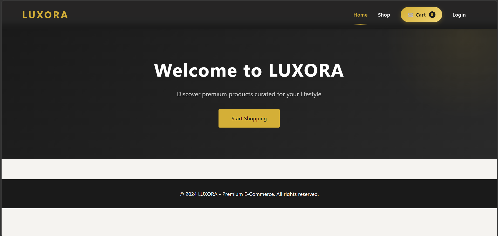
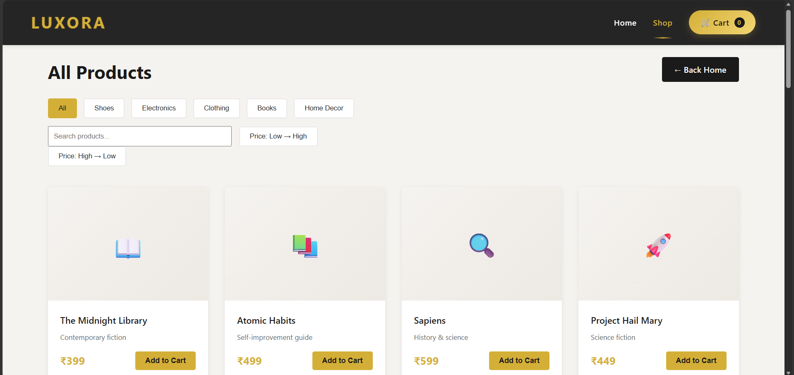
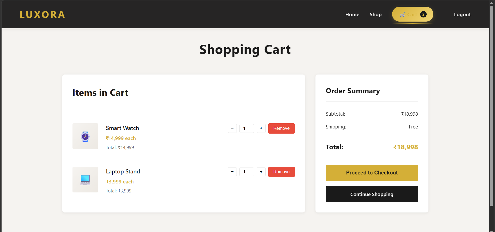

<div align="center">

# 🛍️ LUXORA

### Modern Full-Stack E-Commerce Platform

A responsive e-commerce application built with **HTML, CSS, JavaScript, Flask, and SQLite**, demonstrating frontend-backend integration, REST APIs, database management, and client-side state handling.

<br>

[](https://developer.mozilla.org/en-US/docs/Web/Guide/HTML/HTML5)
[](https://developer.mozilla.org/en-US/docs/Web/CSS)
[](https://developer.mozilla.org/en-US/docs/Web/JavaScript)
[](https://www.python.org/)
[](https://flask.palletsprojects.com/)
[](https://www.sqlite.org/)

<br>

<a href="#-project-showcase">Project Showcase</a> •
<a href="#-key-features">Features</a> •
<a href="#-tech-stack">Tech Stack</a> •
<a href="#-system-architecture">Architecture</a> •
<a href="#-quick-start">Installation</a> •
<a href="#-api-documentation">API</a>

</div>

---

# 📖 About the Project

**Luxora** is a multi-page e-commerce web application developed to demonstrate modern full-stack web development concepts.

The project combines a responsive frontend built with **HTML, CSS, and JavaScript** with a **Python Flask backend** and an **SQLite database**. Products are served through a REST API, dynamically rendered on the client using JavaScript, while shopping cart data is managed through LocalStorage for a smooth user experience.

This project focuses on clean architecture, modular JavaScript, responsive UI design, REST API communication, and database integration.

---

# 📸 Project Showcase

<div align="center">

| Home Page | Products Page | Shopping Cart |
|-----------|---------------|---------------|
|  |  |  |

</div>

---

# ✨ Key Features

## 🎨 Frontend

- Responsive multi-page website
- Modern luxury-inspired UI
- Sticky navigation bar with scroll effects
- Dynamic product rendering using JavaScript
- Category filtering
- Shopping cart with LocalStorage persistence
- Toast notifications
- Smooth animations and hover effects
- Mobile responsive layout

---

## ⚙️ Backend

- Flask REST API
- SQLite database
- Secure Flask template routing
- Product data served as JSON
- CORS support
- Modular backend structure

---

## 🛒 Shopping Cart

- Add products
- Remove products
- Update quantity
- Live cart counter
- Automatic total calculation
- Cart persistence after browser refresh

---

# 💻 Tech Stack

## Frontend

- HTML5
- CSS3
- JavaScript (ES6)

## Backend

- Python
- Flask

## Database

- SQLite

## Development Tools

- VS Code
- Git
- GitHub

---

# 🏗 System Architecture

```
Browser
      │
      ▼
HTML + CSS + JavaScript
      │
      │ fetch()
      ▼
Flask REST API
      │
      ▼
SQLite Database
```

---

## 📁 Project Structure

```text
luxora-ecommerce/
│
├── app.py
├── luxora.db
├── setup_db.py
├── seed_db.py
│
├── templates/
│   ├── index.html
│   ├── products.html
│   ├── cart.html
│   └── login.html
│
├── static/
│   ├── styles.css
│   ├── script.js
│   ├── products.js
│   └── cart.js
│
├── screenshots/
│   ├── home.png
│   ├── products.png
│   └── cart.png
│
└── README.md
```

---

# 🚀 Quick Start

## Clone Repository

```bash
git clone https://github.com/Manmeet2109/luxora-ecommerce.git
```

Move into the project folder.

```bash
cd luxora-ecommerce
```

---

## Install Flask

```bash
pip install flask flask-cors
```

---

## Initialize Database

```bash
python setup_db.py
```

---

## Insert Sample Products

```bash
python seed_db.py
```

---

## Run Application

```bash
python app.py
```

Open

```
http://localhost:5001
```

---

# 🔌 API Documentation

## Get Products

```
GET /api/products
```

### Example Response

```json
{
  "electronics": [
    {
      "id": 1,
      "name": "Wireless Headphones",
      "price": 4999
    }
  ],
  "books": [],
  "clothing": [],
  "home": [],
  "shoes": []
}
```

---

# ⚙️ How It Works

1. Flask starts the backend server.

2. Browser loads HTML pages.

3. JavaScript requests product data using:

```javascript
fetch("/api/products")
```

4. Flask retrieves product information from SQLite.

5. JSON is returned to the browser.

6. JavaScript dynamically creates product cards.

7. Shopping cart is stored using LocalStorage.

---

# 📷 Screenshots

## Home


---

## Products


---

## Cart


---

# 📚 Learning Outcomes

Through this project I learned:

- Full-stack application architecture
- Flask routing
- REST API development
- SQLite database integration
- JavaScript Fetch API
- DOM manipulation
- LocalStorage
- Responsive web design
- GitHub project management

---

# 🚀 Future Improvements

- User Authentication
- User Registration
- Payment Gateway Integration
- Product Search
- Wishlist
- Order History
- User Dashboard
- Admin Panel
- Product Reviews
- Deployment on Render

---

# 👨‍💻 Author

**Manmeet Singh**

B.Tech Computer Science Engineering

Chandigarh University

GitHub:
https://github.com/Manmeet2109

---

# 📄 License

This project is intended for learning, portfolio, and educational purposes.

---

<div align="center">

⭐ If you found this project useful, consider giving it a star!

</div>
